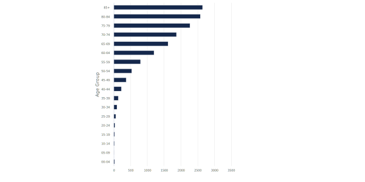

# highcharts_functions
R Functions to build nice interactive charts. 
  
*Built using the highcharter package (https://jkunst.com/highcharter/)* 
  
Highcharter is an R wrapper for the Highcharts Javascript library. Highcharts is generally open source for non-commercial use but check the website for licencing conditions: https://www.highcharts.com/
  
/**/

